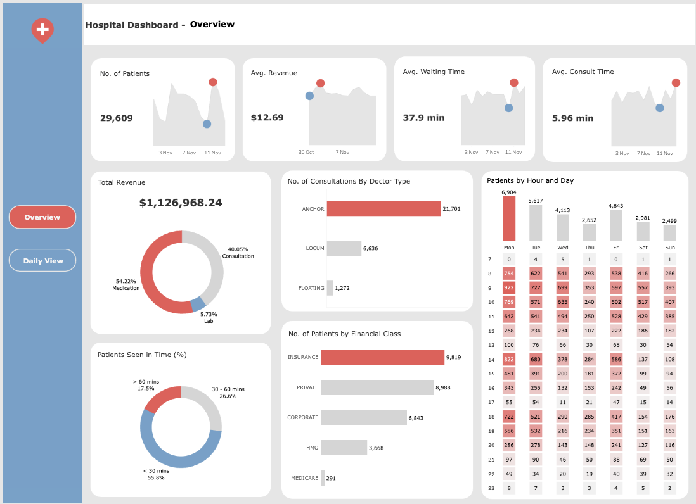

# 🏥 Hospital administration data analytics project

## 📈 Exploratory Data Analysis
[Datasource](https://www.kaggle.com/datasets/abdulqaderasiirii/hospital-patient-data/data)

The goal of this mini project is to answer a few questions regarding administrative issues in this hospital.

1. Are there differences in revenue collection based on `Financial Classes`? What can be done to increase revenue for the hospital based on these differences?

2. Which doctor type generates the most revenue (Medication and Consultation) per consultation?

3. Determine busy periods that require more manpower and make any improvements or suggestions with reference to insights gathered from the analysis.

After answering required questions, cleaned data will be exported for visualisation in Tableau.

## 📊 Tableau Dashboard
### 👀 Preview

You can explore the interactive dashboard on [Tableau Public](https://tinyurl.com/HospitalDashboard).
